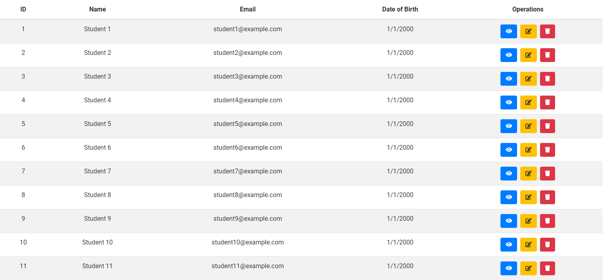
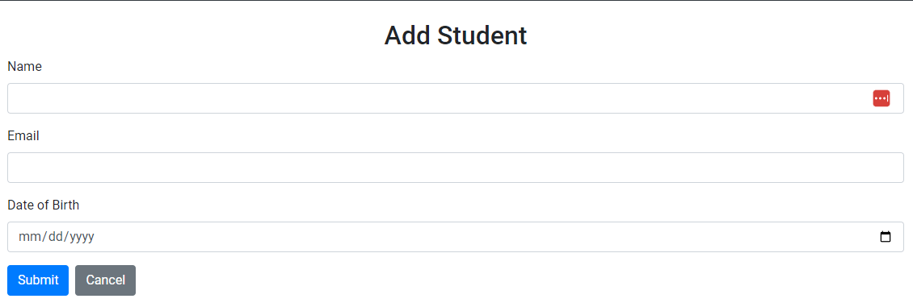
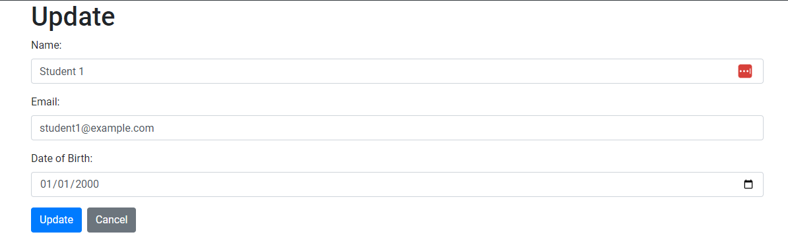
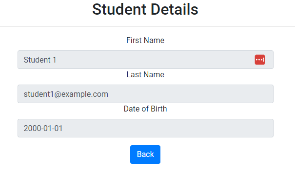
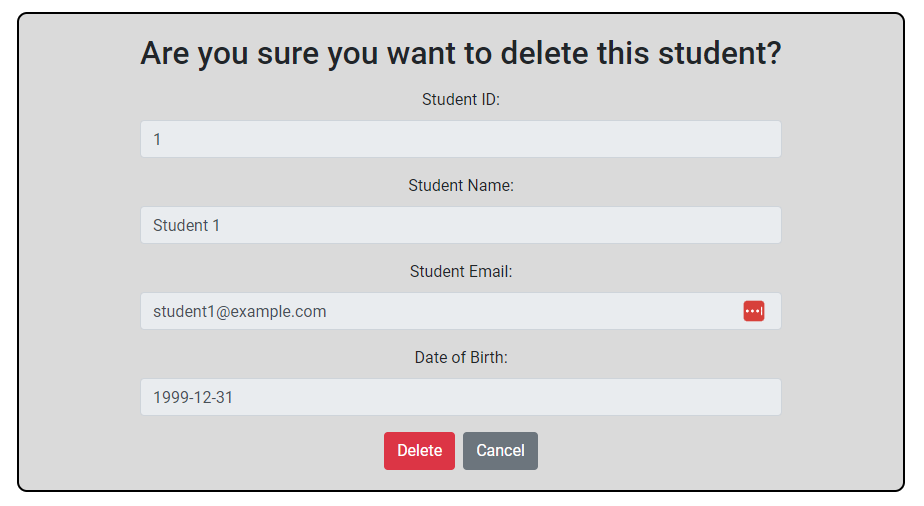

# Students API

## Introduction
This is a simple Spring Boot application that demonstrates how to use Spring Boot with Spring MVC. It also shows how to use Spring Data JPA with PostgreSQL as database. The application is a simple CRUD API that allows students to create new students, list all students, update students' information, and delete students.

## Technologies
* Spring Boot 3.0.6
* Java 17
* PostgreSQL 15.3
* Maven 3.8.3

## Tools
* IntelliJ IDEA 2023.3.2
* pgAdmin 4
* Postman

## Run
* Clone this repository
* Create a PostgreSQL database named `student`
* Change the PostgreSQL username and password in `src/main/resources/application.properties` as per your PostgreSQL installation
* Run the app using `mvn spring-boot:run` or by running the `main` method in `src/main/java/com/example/demo/DemoApplication.java`
* The app will start running at <http://127.0.0.1:8080> but you will need to navigate to <http://127.0.0.1:8080/api/v1/students> to see the API.

## Explore Rest APIs
The app defines following CRUD APIs.

* GET - /api/v1/students

* POST - /api/v1/students
    
* GET - /api/v1/students/{studentId}
    
* PUT - /api/v1/students/?name={studen.name}&email={student.email}&dob={student.dob}
    
* DELETE - /api/v1/students/{studentId}

You can test them using postman or any other rest client.

## Screenshots
Home Page

List of Students

Add Student

Update Student

View Student  

Delete Student

## Contributors
* [Alex Sanderson](https://github.com/vexelior)